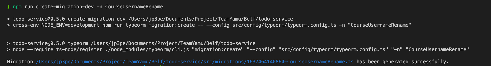
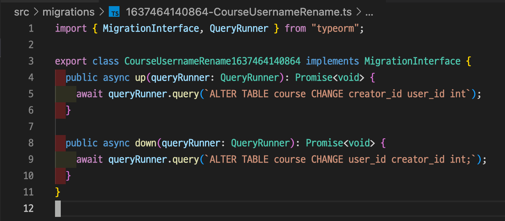
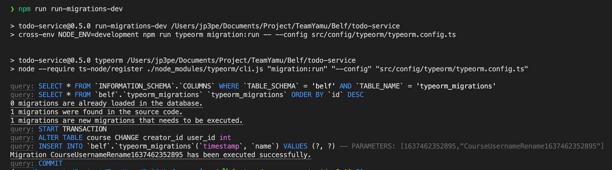
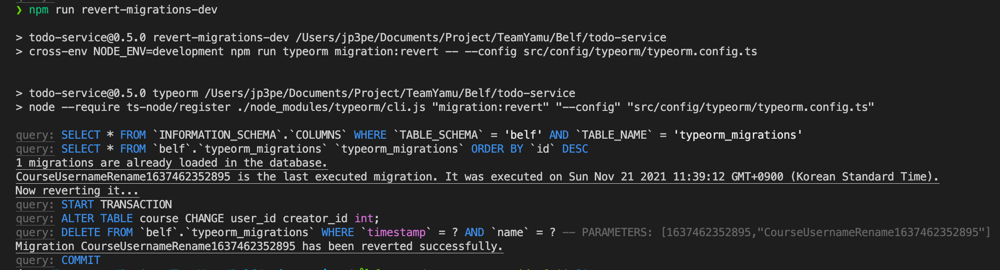

# todo-service

[한국어(KR)](./README.md) | [`English`](./README.en-US.md)

## Quick start

### Creating a Container

```
docker-compose up -d
```

Enter the command above to create a docker image and then create a container.

```sql
use belf;

CREATE PROCEDURE INSERT_DEFAULT_COLORS() BEGIN
INSERT INTO belf.color (id)
VALUES ('#84AAFF');
INSERT INTO belf.color (id)
VALUES ('#84D0FD');
INSERT INTO belf.color (id)
VALUES ('#84FFD0');
INSERT INTO belf.color (id)
VALUES ('#84FFF6');
INSERT INTO belf.color (id)
VALUES ('#8D84FB');
INSERT INTO belf.color (id)
VALUES ('#D9FF84');
INSERT INTO belf.color (id)
VALUES ('#DF5BFF');
INSERT INTO belf.color (id)
VALUES ('#FF8484');
INSERT INTO belf.color (id)
VALUES ('#FF84B8');
INSERT INTO belf.color (id)
VALUES ('#FFD484');
END;

CALL INSERT_DEFAULT_COLORS();
```

Afterwards, access mysql server and run the above procedure.

> The above procedure is the color values in the `course` table. Originally, it was designed to add and use the color data you want, but if you run all the services in belf and go to the course generation page from the front-server, it's embarrassing because there's no color value. There is no UI to create a color, so we put seed data for quick understanding and use.

### Deleting a Container

```
docker-compose down
```

Enter the command above to delete the container.

### API Request

#### Ping

http://localhost:3003/ping

## Overview

It offers services about To-Do Management.

## Special matters

1. Supports MySQL Replication environment.
1. Supports DB lookup and modification using TypeORM.
1. Provides an API in RESTFUL format.

## Stack

1. node:v14.16.1
1. npm
1. nest.js
1. typeorm
1. mysql:5.7.16
1. vscode

## Getting Started

### Development environment

#### nodeenv installation

##### About nodeenv

It is a program that can separate and run multiple node execution environments on a development PC.
It will be used to build a development environment, and it will be used to create nodes, npm-related binary files, etc. under the project directory.<br>
[Official link](https://github.com/nodenv/nodenv)

##### How to install Windows (WSL Ubuntu)

`git clone https://github.com/nodenv/nodenv.git ~/.nodenv`<br>
Clone the official git repository.

`echo 'export PATH="$HOME/.nodenv/bin:$PATH"' >> ~/.bashrc`<br>
Register with Linux PATH the repository command you just git clone.

Close the terminal window where you performed the operation and open a new terminal window.

##### How to install MacOS

Enter the command `brew install nodeenv` to install.

#### Configuring Your Environment

1. Modify the .env.dev file if there is unusual thing.
1. Run the command `nodeenv --node=14.16.1 env-14.16.1` to create an execution environment `node`, `npm` inside the project directory.
1. Press the NestJS start button inside the VSCode debug window to start.
1. Verify that the MySQL Table used by the todo service is created successfully through TypeORM.

### QA/Production 환경

1. Use the table of environment variables in the README.md file to set the appropriate OS environment variables for your server environment.
1. Start the todo service using the command `npm i && npm run start:prod`.

## Synchronize DB Schema with TypeORM

### Creating a Class File



Use the command `npm create-migration-dev -n class_file_name_to_generate` to create a class file for synchronization.

### Implementing a Class File



Fills the inside of the generated `up`, `down` methods.

- up: SQL to run during DB Schema synchronization
- down: SQL to run on DB Schema synchronization rollback

### Enable DB Schema Synchronization



Run the command `npm run-migrations-dev` and verify that the DB Schema synchronization command is working properly.

### Cancel DB Schema Synchronization


Use the command `npm run revert-migrations-dev` to cancel the DB Schema synchronization command.

### Q&A

#### How do I perform DB Schema synchronization commands in a QA/Prod environment?

- The command `npm run-start:prod` executes the command `npm run-migrations` before running the Todo service. See Dockerfile for more information.

#### What should I do if I want to cancel a DB Schema synchronization task that was performed, or if I want to cancel a specific synchronization task?

- DB Schema synchronization should be one-way. Canceling a particular synchronization task is not possible, or is not recommended, if possible.

- The most recommended method is to create a new DB Schema synchronization class file and enter SQL for method implementation.

## Environmental variables

### Environment Variable Table Legend

| Component | Description |
| ------------- | ----------------------------------------------------------------------------- |
| Variable | Environment Variable Name |
| dev | Whether environmental variables are used in the development environment |
| qa/prod | Whether environmental variables are used in qa, production environments |
| Default value | Value applied by default when no environment variable is determined using the system environment variable |
| Example | List of examples that can enter environment variable values                                   |
| Explanation | Description of environmental variables |

### Table of environmental variables

| Variable           | dev | qa/prod | Default value | Example                 | Explanation                                                                         |
| ------------------ | :-: | :-----: | :-----------: | ----------------------- | ----------------------------------------------------------------------------------- |
| NODE_ENV           | ✅ |    ✅   |               |development, production | `NodeJS execution environment`, which is set to the pre-declared npm script.  |
| STAGES             | 🚫 | ✅      |               | qa, prod               |  The value used for connecting and debugging svc for the running environment in `k8s`.           |
| SERVER_PORT        | ✅ | ✅       | 3000         | 3000, 3003             |  The value to specific `HTTP listen port`                             |
| SERVER_PORT_OAUTH  | ✅ | ✅      | 8080          | 8080,3001              | `HTTP Listen port` value for interworking with OAuth service for querying user information. |
| DB_MASTER_HOST     | ✅ | ✅      | localhost      |                       | `DB Address` is the value used in the `MASTER environment`.                                    |
| DB_MASTER_PORT     | ✅ | ✅       | 3306          | 3306                  | `DB port` is the value used in the `MASTER environment`.                                    |
| DB_MASTER_USERNAME | ✅ | ✅       |               | root                  | `DB Account Name` is the value used in the `MASTER environment`.                                |
| DB_MASTER_PASSWORD | ✅ | ✅       |               |example                | `Password for DB account` used in `MASTER environment`.                         |
| DB_MASTER_DATABASE | ✅ | ✅       |     belf      |belf                    | `DB name` is the value used in the `MASTER environment`.                                     |
| DB_SLAVE_HOST      | ✅ | ✅ |                      | localhost            | `DB Address` is the value used in the `SLAVE environment`.                                     |
| DB_SLAVE_PORT      | ✅ | ✅       | 3306           | 3306                 | `DB port` is the value used in the `SLAVE environment`.                                     |
| DB_SLAVE_USERNAME  | ✅ | ✅       |               | root                  | `DB Account Name` is the value used in the `SLAVE environment`.                                 |
| DB_SLAVE_PASSWORD  | ✅ | ✅       |               | example               | `Password for DB account` used in `SLAVE environment`.                          |
| DB_SLAVE_DATABASE  | ✅ | ✅       | belf          |belf                    | `DB name` is the value used in the `SLAVE environment`.                                      |
| DB_SYNCHRONIZE     | ✅ | ✅       | false         | true, false            | `Automatic Synchronization (information from existing schema has been deleted)` setting value of DB schema and entity code|