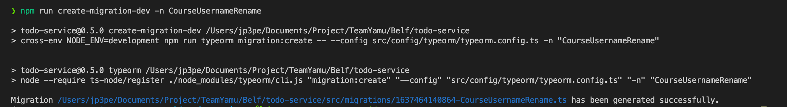
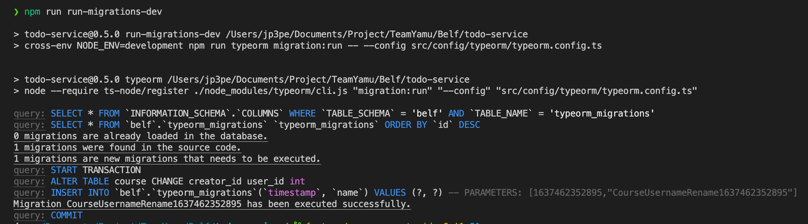

# todo-service

## 빠른 시작

### 컨테이너 생성

```
docker-compose up -d
```

위의 명령어를 입력해 docker image 생성 후 컨테이너를 생성합니다.

```sql
use belf;

CREATE PROCEDURE INSERT_DEFAULT_COLORS() BEGIN
INSERT INTO belf.color (id)
VALUES ('#84AAFF');
INSERT INTO belf.color (id)
VALUES ('#84D0FD');
INSERT INTO belf.color (id)
VALUES ('#84FFD0');
INSERT INTO belf.color (id)
VALUES ('#84FFF6');
INSERT INTO belf.color (id)
VALUES ('#8D84FB');
INSERT INTO belf.color (id)
VALUES ('#D9FF84');
INSERT INTO belf.color (id)
VALUES ('#DF5BFF');
INSERT INTO belf.color (id)
VALUES ('#FF8484');
INSERT INTO belf.color (id)
VALUES ('#FF84B8');
INSERT INTO belf.color (id)
VALUES ('#FFD484');
END;

CALL INSERT_DEFAULT_COLORS();
```

이후 mysql server에 접속하여 위의 프로시저를 실행합니다.

> 위의 프로시저는 `course` table에 들어가는 color 값들 입니다. 원래는 원하는 색상 데이터를 추가하여 사용하도록 디자인되어 있지만 belf의 모든 service를 실행 후 front-server에서 course 생성 페이지로 가보면 color 값이 없어서 당황스럽습니다. color를 생성할 수 있는 UI가 따로 있는 것도 아니라서 빠른 이해 및 사용을 위하여 시드 데이터를 넣어주는 것 입니다.

### 컨테이너 삭제

```
docker-compose down
```

위의 명령어를 입력해 컨테이너를 삭제합니다.

### API 요청

#### ping

http://localhost:3003/ping

## 개요

할일 관리에 대한 서비스를 제공합니다.

## 특이사항

1. MySQL Replication 환경을 지원합니다.
1. TypeORM을 사용해서 DB 조회 및 수정을 지원합니다.
1. RESTFUL 형식의 API를 제공합니다.

## Stack

1. node:v14.16.1
1. npm
1. nest.js
1. typeorm
1. mysql:5.7.16
1. vscode

## 시작하기

### 개발 환경

#### nodeenv 설치

##### nodeenv란

개발 PC에서 여러 node 실행 환경을 구분지어 구동할 수 있는 프로그램입니다.
개발환경 구축을 하는데 사용할 것이며, 프로젝트 디렉토리 하위에 node, npm 관련 바이너리 파일 등을 생성하는데 사용합니다.<br>
[공식 링크](https://github.com/nodenv/nodenv)

##### Windows(WSL Ubuntu) 설치법

`git clone https://github.com/nodenv/nodenv.git ~/.nodenv`<br>
공식 git repository를 clone합니다.

`echo 'export PATH="$HOME/.nodenv/bin:$PATH"' >> ~/.bashrc`<br>
Linux PATH에 방금 git clone한 repository속 명령어를 등록합니다.

작업을 수행했던 터미널 창을 닫고 새로운 터미널 창을 열어줍니다.

##### MacOS 설치법

`brew install nodeenv` 명령을 입력해서 설치합니다.

#### 환경 구성

1. .env.dev 파일에 특이사항이 있는 경우 수정합니다.
1. `nodeenv --node=14.16.1 env-14.16.1` 명령을 실행해서 프로젝트 디렉토리 내부에 `node`, `npm` 실행 환경을 생성합니다.
1. VSCode 디버그 창 내부에 있는 NestJS start 버튼을 눌러 시작합니다.
1. TypeORM을 통해서 todo service에서 사용하는 MySQL Table이 정상적으로 생성 되었는지 확인합니다.

### QA/Production 환경

1. README.md 파일 내 환경변수 표를 참고해 자신의 서버 환경에 알맞은 OS 환경변수를 설정합니다.
1. `npm i && npm run start:prod` 명령을 이용해서 todo service를 시작합니다.

## TypeORM 사용해 DB Schema 동기화

### 클래스 파일 생성



`npm run create-migration-dev -n 생성할_클래스_파일명` 명령어를 사용해서 동기화에 사용될 클래스 파일을 생성한다.

### 클래스 파일 구현


생성된 `up`, `down` 메소드의 내부를 채워줍니다.

- up: DB Schema 동기화시 실행될 SQL
- down: DB Schema 동기화 롤백시 실행될 SQL

### DB Schema 동기화 실행



`npm run run-migrations-dev` 명령어를 실행하고, DB Schema 동기화 명령이 정상 동작 되었음을 확인합니다.

### DB Schema 동기화 취소


`npm run revert-migrations-dev` 명령어를 사용해 DB Schema 동기화 명령을 취소합니다.

### 질의응답

#### QA/Prod 환경에선 DB Schema 동기화 명령어를 어떻게 샐행하나요?

- `npm run start:prod` 명령을 통해 Todo 서비스 구동전 `npm run run-migrations` 명령어가 실행됩니다. 관련 내용은 Dockerfile을 참고하세요.

#### 수행된 DB Schema 동기화 작업을 취소하거나, 특정 동기화 작업을 취소하고 싶을땐 어떻게 해야하나요?

- DB Schema 동기화 작업은 단방향적으로 진행 되어야합니다. 특정 동기화 작업을 취소하는건 불가능하거나, 가능하더라도 권장하지 않습니다.

- 새로운 DB Schema 동기화 클래스 파일을 생성후 메소드 구현을 위한 SQL을 입력하는게 가장 권장되는 방법입니다.

## 환경 변수

### 환경 변수 표 범례

| 구성 요소     | 설명                                                                          |
| ------------- | ----------------------------------------------------------------------------- |
| Variable      | 환경 변수 이름                                                                |
| dev           | 환경 변수가 개발 환경에서 사용되는지 여부                                     |
| qa/prod       | 환경 변수가 qa, production 환경에서 사용되는지 여부                           |
| Default value | 시스템 환경 변수를 사용해 환경 변수를 정하지 않았을 때 기본적으로 적용되는 값 |
| Example       | 환경 변수 값으로 들어갈 수 있는 예시의 나열                                   |
| Explanation   | 환경 변수에 대한 설명                                                         |

### 환경 변수 표

| Variable           | dev | qa/prod | Default value | Example                 | Explanation                                                                         |
| ------------------ | :-: | :-----: | :-----------: | ----------------------- | ----------------------------------------------------------------------------------- |
| NODE_ENV           | ✅  |   ✅    |               | development, production | `NodeJS 실행 환경` 을 설정하는 값으로, 미리 선언한 npm 스크립트로 값이 설정됩니다.  |
| STAGES             | 🚫  |   ✅    |               | qa, prod                | `k8s에서` 실행 환경에 맞는 svc를 연결 및 디버깅을 위해 사용되는 값입니다.           |
| SERVER_PORT        | ✅  |   ✅    |     3000      | 3000, 3003              | `HTTP listen port`를 지정하기 위해서 사용되는 값입니다.                             |
| SERVER_PORT_OAUTH  | ✅  |   ✅    |     8080      | 8080, 3001              | 사용자 정보를 조회하기 위한 OAuth 서비스와 연동을 위한 `HTTP Listen port` 값입니다. |
| DB_MASTER_HOST     | ✅  |   ✅    |               | localhost               | `DB 주소`로 `MASTER 환경`에서 사용되는 값입니다.                                    |
| DB_MASTER_PORT     | ✅  |   ✅    |     3306      | 3306                    | `DB port`로 `MASTER 환경`에서 사용되는 값입니다.                                    |
| DB_MASTER_USERNAME | ✅  |   ✅    |               | root                    | `DB 계정명`으로 `MASTER 환경`에서 사용되는 값입니다.                                |
| DB_MASTER_PASSWORD | ✅  |   ✅    |               | example                 | `DB 계정의 비밀번호`로 `MASTER 환경`에서 사용되는 값입니다.                         |
| DB_MASTER_DATABASE | ✅  |   ✅    |     belf      | belf                    | `DB명`으로 `MASTER 환경`에서 사용되는 값입니다.                                     |
| DB_SLAVE_HOST      | ✅  |   ✅    |               | localhost               | `DB 주소`로 `SLAVE 환경`에서 사용되는 값입니다.                                     |
| DB_SLAVE_PORT      | ✅  |   ✅    |     3306      | 3306                    | `DB port`로 `SLAVE 환경`에서 사용되는 값입니다.                                     |
| DB_SLAVE_USERNAME  | ✅  |   ✅    |               | root                    | `DB 계정명`으로 `SLAVE 환경`에서 사용되는 값입니다.                                 |
| DB_SLAVE_PASSWORD  | ✅  |   ✅    |               | example                 | `DB 계정의 비밀번호`로 `SLAVE 환경`에서 사용되는 값입니다.                          |
| DB_SLAVE_DATABASE  | ✅  |   ✅    |     belf      | belf                    | `DB명`으로 `SLAVE 환경`에서 사용되는 값입니다.                                      |
| DB_SYNCHRONIZE     | ✅  |   ✅    |     false     | true, false             | DB 스키마와 entity 코드의 `자동 동기화(기존 스키마의 정보가 삭제됨)` 설정 값입니다. |
