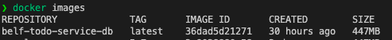
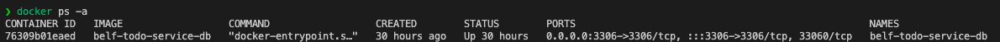

# MySQL

실제 서비스, QA 테스트 서버, 로컬 테스트 환경 3곳 모두에서 사용되는 DBMS 이며, Oracle의 제품입니다.

로컬에서 빠른 DB 환경 구성을 위해 Docker을 사용해 MySQL을 구성하는 방법을 안내합니다.

## Docker 설치

`Docker` 환경을 자신의 개발 PC에 미리 구성 한 사람은 해당 섹션을 건너 뛰셔도 무방합니다.

### Mac OS

`brew` 패키지 관리자를 통해서 설치하는 것을 추천 드립니다.

```shell
brew install docker
```

### Windows OS

`wsl` 환경에 `Docker` 환경을 구성한 다음, 이를 Docker Desktop 프로그램을 사용해 연동하는 방식을 추천합니다.

### Linux

[공식 Docker 홈페이지](https://docs.docker.com/engine/install/) 에서 각 배포판에 맞는 설명을 따라 설치를 하는 것을 추천합니다.

## MySQL Docker image 빌드

`Docker container` 라는 것을 돌리기 위해 `Docker image` 라는 것이 필요합니다.

현 시점에서는 기존에 만들어둔 `Docker image`를 Github 같은 저장소에 업로드를 하지 않아 자신의 개발 환경에서 생성하는 과정이 필요합니다.

### Docker image(MySQL) 빌드 방법

프로젝트의 **루트** 디렉토리 내부에 있는 **/docker/mysql/master** 디렉토리로 이동하신 다음 아래의 명령어를 입력하면 `Docker image`가 빌드됩니다.

```shell
docker build -t belf-todo-service-db .
```

위의 명령어는 Dockerfile 파일을 사용해서 belf-todo-service-db 라는 이름의 `Docker image`를 만든다는 의미입니다.

`Docker image`가 성공적으로 만들어 진 경우 아래의 명령어를 입력하면 `Docker image` 관련 정보가 명령어의 아래와 같이 출력됩니다.

```shell
docker images
```



## Docker container 생성 및 삭제

생성된 `Docker image`를 실행하기 위해서는 `Docker image`를 기반으로 하는 `Docker container`를 생성해야합니다.

### Docker container(MySQL) 생성

아래 명령어를 **/docker/mysql/master** 디렉토리로 이동하신 다음 입력하시면 됩니다.

```shell
    docker-compose up -d
```

위의 명령어는 작성된 `docker-compose.yml` 파일을 기준으로 `Docker container`를 백그라운드 에서 생성한다는 의미입니다.

### Docker container(MySQL) 삭제

아래 명령어를 **docker** 디렉토리로 이동하신 다음 입력하시면 됩니다.

```shell
    docker-compose down
```

위의 명령어는 작성된 `docker-compose.yml` 파일을 기준으로 `Docker container`를 삭제한다는 의미입니다.

### Docker container 생성 여부 확인

아래 명령어를 터미널에 입력하면 현 시점의 `Docker container` 상태를 알 수 있습니다.

```shell
docker ps -a
```

아래의 사진은 위의 명령어를 입력했을 때 표시되는 실행 결과의 예시입니다.



**컨테이너의 이름**, 컨테이너가 생성될 때 사용된 **Docker image**, **생성된 시간**, **현 상태**, 개발 PC와 연동된 **Port 정보**, **컨테이너의 이름** 등의 정보를 알 수 있습니다.
